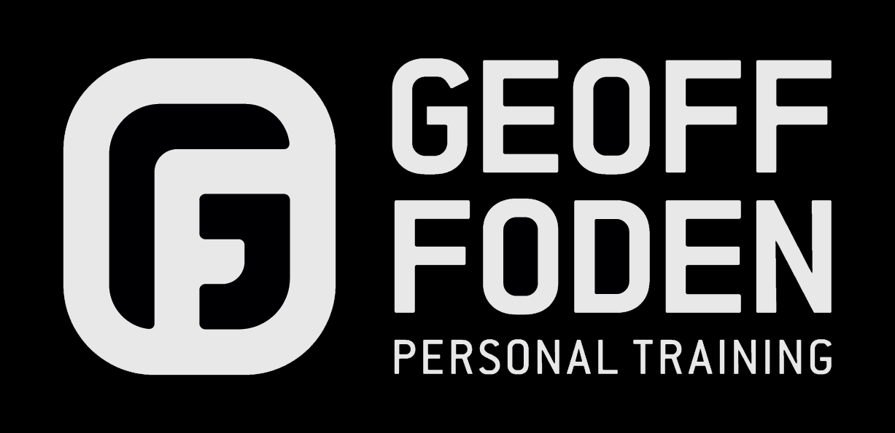

# GFPT App



A website app for Geoff Foden, Personal Training, in which users can read about Geoff, get useful hints and tips, register as a user and book PT sessions

## Frameworks & APIs
- [Django](https://www.djangoproject.com/) - Application
- [MaterialiseCSS](https://materializecss.com/) - Core styling framework
- [jQuery](https://cdnjs.cloudflare.com/ajax/libs/jquery/3.2.1/jquery.min.js) - Core JS framework
- [AWS S3](https://aws.amazon.com/s3/) - Static & Media Storage
- [Heroku Postgres](https://dashboard.heroku.com/) - Database

## Installation
Use the package manager [pip](https://pip.pypa.io/en/stable/) to install jpt-app within a virtual environment (assumed "venv"):

```bash
source venv/bin/activate
pip install requirements.txt
```


## License
There are currently no licensing on this application
